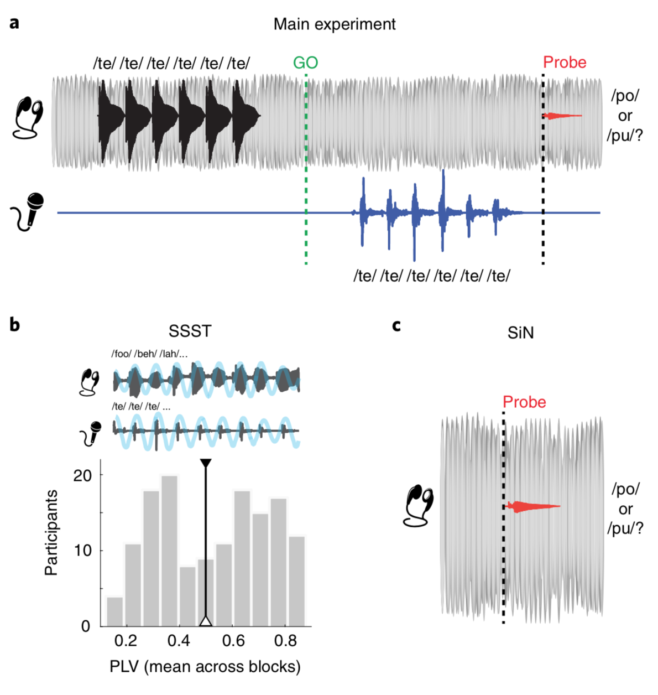
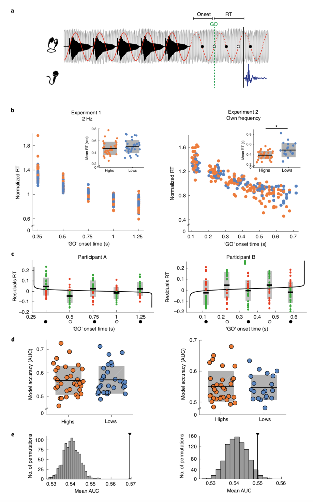
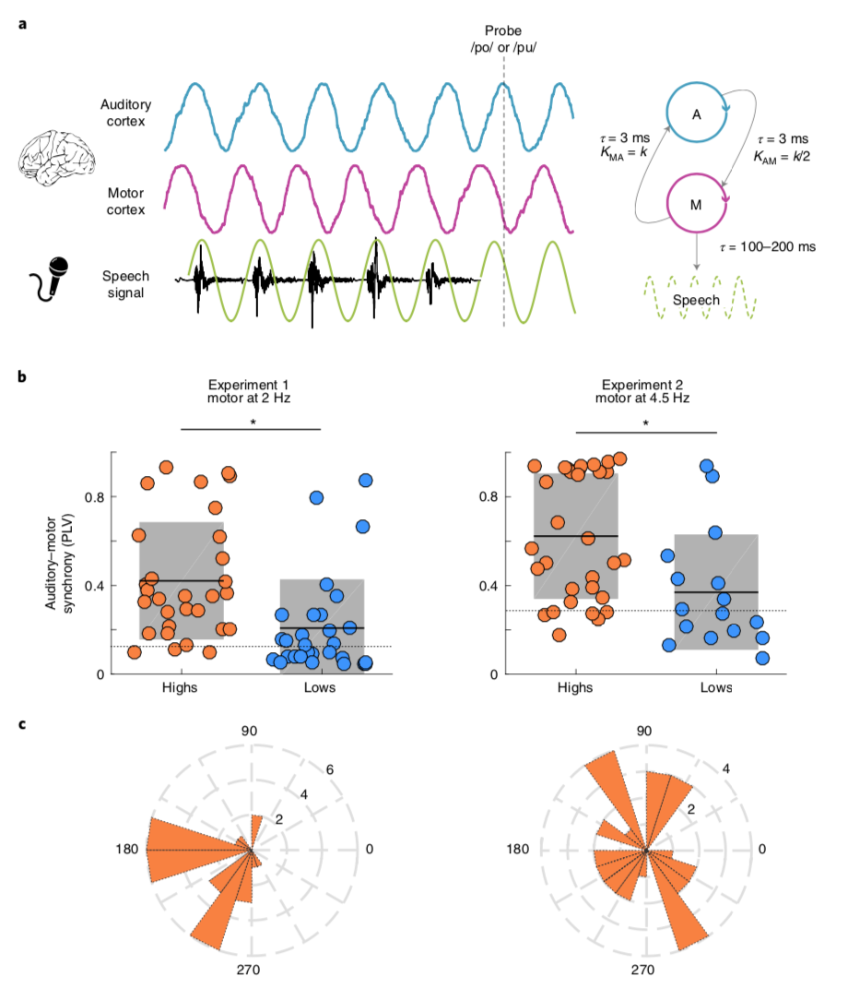

## 文献信息

Assaneo, M. F., Rimmele, J. M., Sanz Perl, Y., & Poeppel, D. (2020). Speaking rhythmically can shape hearing. *Nature Human Behavior*. doi:10.1038/s41562-020-00962-0

---
## 背景

- 前人研究发现运动系统中产生的时域性预测能够提高言语觉知水平。

- 但是鲜有研究去考察言语产出能否对言语理解本身产生调节（modulation）。

- 本文就考察了这个问题。

---
## 实验任务

---

---
## 实验设计和实验任务

- 自主言语同步测验 (Spontaneous speech synchronization test, SSST)
- 个体言语识别阈限 (speech-in-noise thresholds, SiN): 70%
- 确定个体呈现频率确定方式：以4.5Hz的频率产出音节/te/, 并让被试以自己最自然的频率低吟该音节。
- 主任务：听-复述-识别
- 音节呈现频率：2Hz (实验1) 和个性频率 (实验2)。

---
## 数据分析
---

---
## 音节正确识别率

---

---
## 复述开始时间

---

---
## 神经模型

---

---
## 讨论

- 发展障碍儿童？
